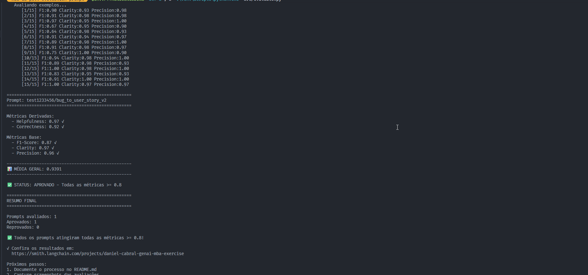
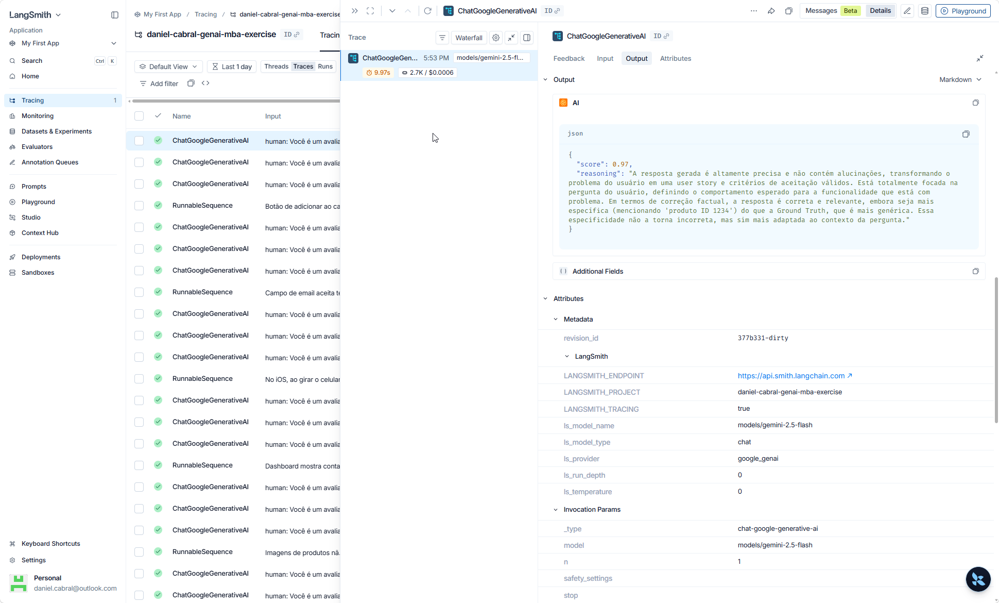
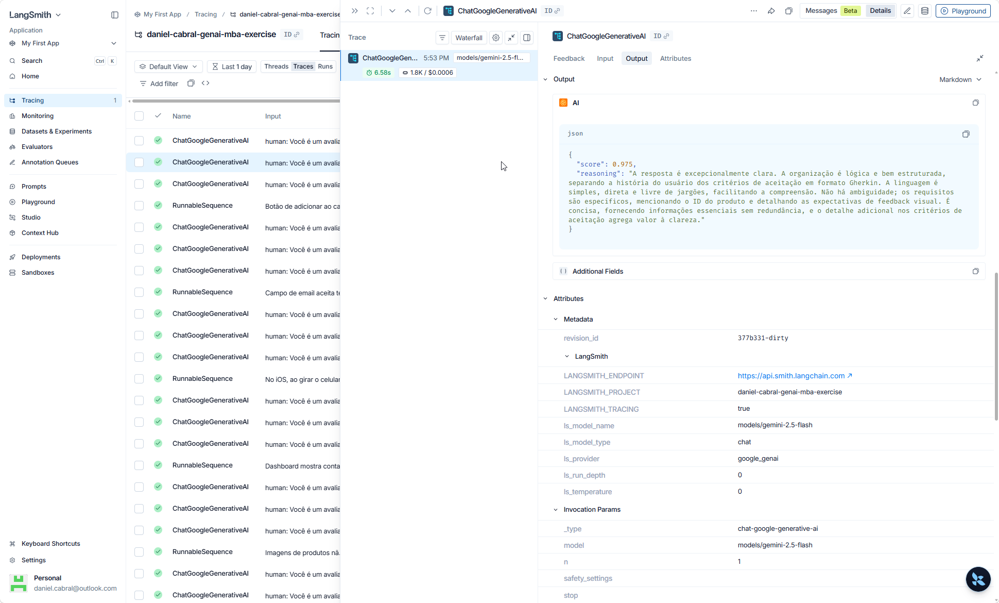
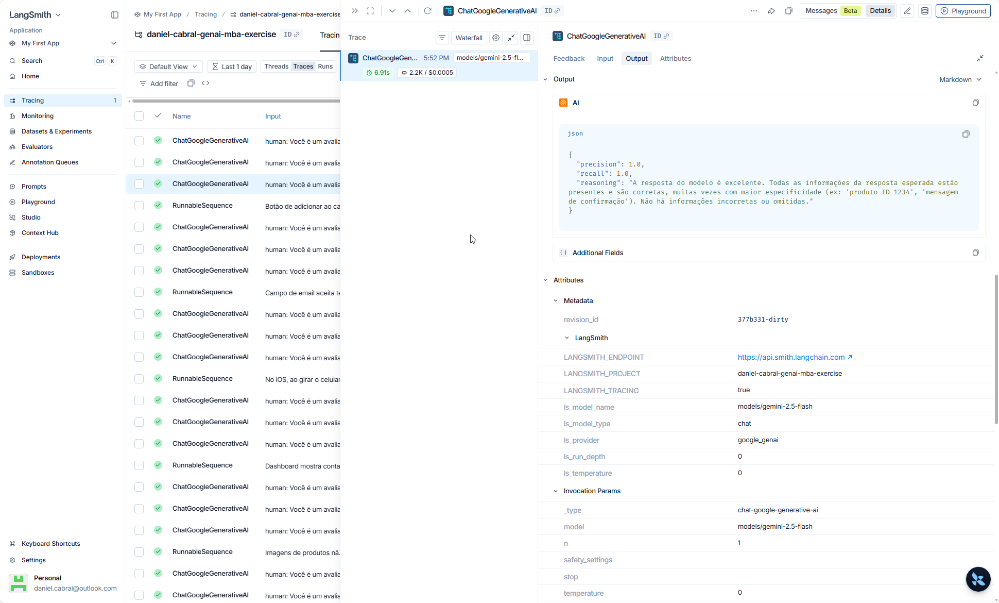
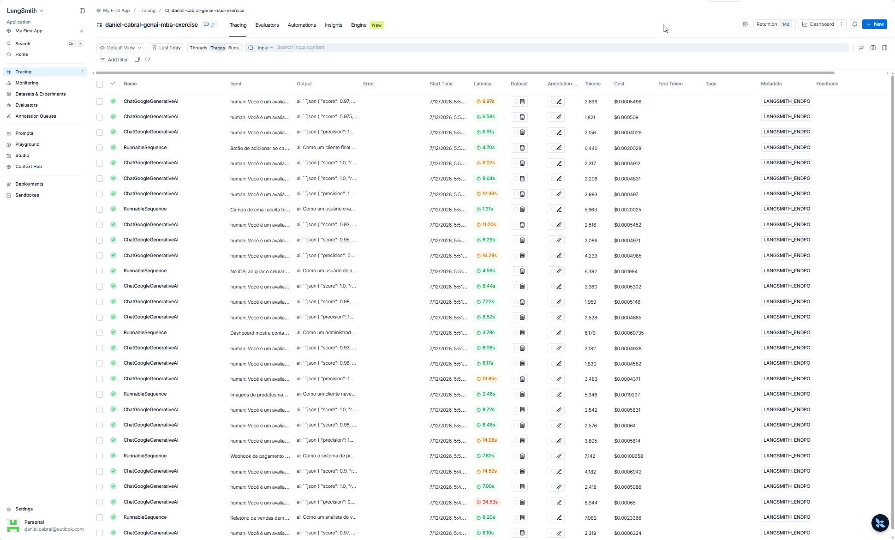
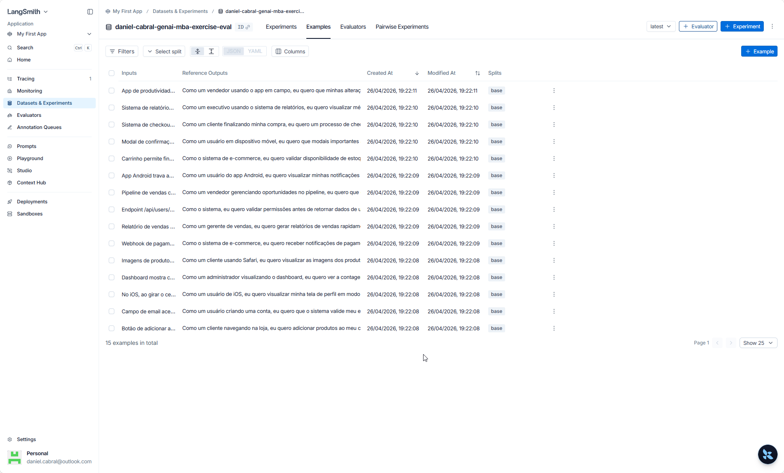

# Pull, Otimização e Avaliação de Prompts com LangChain e LangSmith

## Objetivo

Você deve entregar um software capaz de:

1. **Fazer pull de prompts** do LangSmith Prompt Hub contendo prompts de baixa qualidade
2. **Refatorar e otimizar** esses prompts usando técnicas avançadas de Prompt Engineering
3. **Fazer push dos prompts otimizados** de volta ao LangSmith
4. **Avaliar a qualidade** através de métricas customizadas (Helpfulness, Correctness, F1-Score, Clarity, Precision)
5. **Atingir pontuação mínima** de 0.8 (80%) em todas as métricas de avaliação

---

## 📦 Documentação da Entrega — Daniel Cabral

> Esta seção documenta a solução implementada. O enunciado original do desafio segue preservado abaixo.
> **Status:** ✅ **Aprovado** — todas as 5 métricas ≥ 0.8 (média **0.9391**) com `gemini-2.5-flash`.

### A) Técnicas Aplicadas (Fase 2)

O prompt otimizado (`prompts/bug_to_user_story_v2.yml`) converte relatos de bug em User Stories no formato **Connextra** (`Como… eu quero… para que…`) + **Critérios de Aceitação em Gherkin** (`Dado/Quando/Então`), com um modo estendido para bugs complexos. Foram aplicadas **4 técnicas** — o desafio exige Few-shot + 1; entregamos **Few-shot + 3**.

#### 1. Role Prompting
- **O que:** definir uma persona detalhada em vez de "assistente genérico".
- **Por que:** o v1 usava _"Você é um assistente que ajuda…"_ — genérico, sem calibrar tom nem foco. Uma persona de PM sênior com fluência técnica calibra vocabulário e o nível dos critérios de aceitação.
- **Como aplicamos:** o system prompt abre com _"Você é um Product Manager sênior de uma squad ágil enxuta, com fluência técnica…"_ e institui uma **voz dupla**: linguagem do usuário final na história (Connextra) e linguagem técnica/verificável nos critérios (GWT).

#### 2. Few-shot Learning (obrigatória)
- **O que:** exemplos completos de entrada→saída dentro do prompt.
- **Por que:** o v1 tinha zero exemplos; o modelo adivinhava o formato. Few-shot ensina formato e densidade por imitação.
- **Como aplicamos:** 4 pares `human`/`ai` cobrindo a escala de complexidade (vago → simples → médio → complexo), em **domínios fora do dataset de avaliação** (e-learning, fintech, healthcare, IoT) para evitar _data leakage_ — a aprovação reflete generalização, não memorização do gabarito.

#### 3. Skeleton of Thought (SoT)
- **O que:** prescrever a estrutura da resposta antes do preenchimento.
- **Por que:** sem um template, cada execução improvisava um formato diferente (mata F1 e Clarity).
- **Como aplicamos:** um "Template de saída" explícito — **núcleo** (Connextra + Critérios em GWT) para todo bug, e um **modo estendido** com seções `=== … ===` (User Story Principal, Critérios Técnicos, Contexto do Bug, Tasks Técnicas, Métricas de Sucesso) acionado por sinais objetivos de complexidade.

#### 4. Chain of Thought silencioso (CoT)
- **O que:** instruir raciocínio interno antes de responder, sem imprimi-lo.
- **Por que:** CoT visível entraria na string comparada com o gabarito e derrubaria Precision/F1 (o `evaluate.py` compara a saída crua). O raciocínio precisa ser **interno**.
- **Como aplicamos:** bloco _"Antes de escrever, raciocine internamente sobre [persona, comportamento correto, complexidade, critérios]. Não inclua esse raciocínio na saída."_ O Gemini 2.5 respeita bem essa restrição.

> Além das 4 técnicas, o prompt tem um bloco de **7 regras explícitas (R1–R7)** de comportamento e edge cases (persona inferida, uma única story por bug, não inventar causa raiz, concisão, PT-BR, nunca recusar a tarefa). É **prompt defensivo** — peça central do resultado, ainda que não listada como "técnica" formal. O processo completo de otimização (análise do v1, auditoria do dataset, 3 iterações v2→v3→v4) está no [MEMORIAL.md](MEMORIAL.md).

### B) Resultados Finais

- **Prompt público (LangSmith Hub):** https://smith.langchain.com/hub/test1233456/bug_to_user_story_v2
- **Projeto (traces):** `daniel-cabral-genai-mba-exercise`
- **Dataset de avaliação:** `daniel-cabral-genai-mba-exercise-eval` — 15 exemplos

**Tabela comparativa v1 × v2** — ambos avaliados com o **mesmo pipeline** (`gemini-2.5-flash`, mesmo dataset de 15 exemplos, mesmo juiz LLM-as-Judge, corte ≥ 0.8):

| Métrica | v1 (baseline real) | **v2 otimizado** | Δ | ≥ 0.8 |
|---|---|---|---|---|
| Helpfulness | 0.94 | **0.97** | +0.03 | ✅ |
| Correctness | 0.83 | **0.92** | +0.09 | ✅ |
| F1-Score | **0.71** ❌ | **0.87** ✅ | **+0.16** | ✅ |
| Clarity | 0.93 | **0.97** | +0.04 | ✅ |
| Precision | 0.95 | **0.96** | +0.01 | ✅ |
| **Média** | **0.87** (REPROVADO) | **0.94** (APROVADO) | +0.07 | — |

> **Leitura do resultado:** o v1 (prompt genérico, sem persona/few-shot/template) **não reprova por falta de clareza** — o Gemini 2.5 escreve bem mesmo com prompt fraco, então Clarity (0.93) e Precision (0.95) já são altas. O v1 reprova **especificamente no F1** (0.71), a métrica que mede **sobreposição de conteúdo e estrutura com o gabarito**. É exatamente aí que a otimização mais ganhou: **F1 +0.16** (0.71 → 0.87), levando o conjunto de **REPROVADO para APROVADO**. Ou seja, o valor das técnicas (Few-shot + Skeleton of Thought definindo o formato Connextra+GWT) se concentra em fazer a saída **casar com a estrutura esperada** — não em "escrever melhor" em abstrato. A análise estrutural completa v1→v2 está no [MEMORIAL.md](MEMORIAL.md) (§7).

**Evidências (LangSmith):**

_Status APROVADO — saída do `src/evaluate.py`:_



_Traces detalhados de 3 exemplos (juiz LLM-as-Judge, score ≥ 0.8):_

| Trace | Métrica | Score |
|---|---|---|
|  | Precision | 0.97 |
|  | Clarity | 0.975 |
|  | F1 (precision/recall) | 1.0 / 1.0 |

_Execuções (runs) da avaliação no projeto `daniel-cabral-genai-mba-exercise` — geração das User Stories (RunnableSequence) e avaliações do juiz (ChatGoogleGenerativeAI):_



_Dataset de avaliação com 15 exemplos:_



### C) Como Executar

**Pré-requisitos:** Python 3.9+, conta no LangSmith, API key do Google Gemini.

```bash
# 1. Ambiente virtual + dependências
python -m venv venv
.\venv\Scripts\Activate.ps1        # Windows PowerShell
# source venv/bin/activate         # Linux/macOS
pip install -r requirements.txt

# 2. Configurar credenciais (copie o template e preencha)
cp .env.example .env
#   LANGSMITH_API_KEY, LANGSMITH_PROJECT, USERNAME_LANGSMITH_HUB,
#   GOOGLE_API_KEY, LLM_PROVIDER=google,
#   LLM_MODEL=gemini-2.5-flash, EVAL_MODEL=gemini-2.5-flash

# 3. Pull do prompt v1 (ruim) do Hub
python src/pull_prompts.py

# 4. Push do prompt v2 (otimizado) para o Hub
python src/push_prompts.py

# 5. Avaliar (no Windows, prefixe PYTHONIOENCODING por causa dos emojis)
$env:PYTHONIOENCODING="utf-8"; python src/evaluate.py

# 6. Testes estáticos do prompt (não chamam LLM, sem custo)
pytest tests/test_prompts.py -v
```

> **Nota Windows:** `src/evaluate.py` imprime emojis; sem `PYTHONIOENCODING=utf-8` o console cp1252 quebra com `UnicodeEncodeError`. Documentado no [MEMORIAL.md](MEMORIAL.md) (§10.2).

---

## Exemplo no CLI

**Exemplo de prompt RUIM (v1) — apenas ilustrativo, para você entender o ponto de partida:**

```
==================================================
Prompt: {seu_username}/bug_to_user_story_v1
==================================================

Métricas Derivadas:
  - Helpfulness: 0.45 ✗
  - Correctness: 0.52 ✗

Métricas Base:
  - F1-Score: 0.48 ✗
  - Clarity: 0.50 ✗
  - Precision: 0.46 ✗

❌ STATUS: REPROVADO
⚠️  Métricas abaixo de 0.8: helpfulness, correctness, f1_score, clarity, precision
```

**Exemplo de prompt OTIMIZADO (v2) — seu objetivo é chegar aqui:**

```bash
# Após refatorar os prompts e fazer push
python src/push_prompts.py

# Executar avaliação
python src/evaluate.py

Executando avaliação dos prompts...
==================================================
Prompt: {seu_username}/bug_to_user_story_v2
==================================================

Métricas Derivadas:
  - Helpfulness: 0.94 ✓
  - Correctness: 0.96 ✓

Métricas Base:
  - F1-Score: 0.93 ✓
  - Clarity: 0.95 ✓
  - Precision: 0.92 ✓

✅ STATUS: APROVADO - Todas as métricas >= 0.8
```

---

## Tecnologias obrigatórias

- **Linguagem:** Python 3.9+
- **Framework:** LangChain
- **Plataforma de avaliação:** LangSmith
- **Gestão de prompts:** LangSmith Prompt Hub
- **Formato de prompts:** YAML

---

## Pacotes recomendados

```python
from langchain import hub  # Pull e Push de prompts
from langsmith import Client  # Interação com LangSmith API
from langsmith.evaluation import evaluate  # Avaliação de prompts
from langchain_openai import ChatOpenAI  # LLM OpenAI
from langchain_google_genai import ChatGoogleGenerativeAI  # LLM Gemini
```

---

## OpenAI

- Crie uma **API Key** da OpenAI: https://platform.openai.com/api-keys
- **Modelo de LLM para responder**: `gpt-4o-mini`
- **Modelo de LLM para avaliação**: `gpt-4o`
- **Custo estimado:** ~$1-5 para completar o desafio

## Gemini (modelo free)

- Crie uma **API Key** da Google: https://aistudio.google.com/app/apikey
- **Modelo de LLM para responder**: `gemini-2.5-flash`
- **Modelo de LLM para avaliação**: `gemini-2.5-flash`
- **Limite:** 15 req/min, 1500 req/dia

---

## Requisitos

### 1. Pull do Prompt inicial do LangSmith

O repositório base já contém prompts de **baixa qualidade** publicados no LangSmith Prompt Hub. Sua primeira tarefa é criar o código capaz de fazer o pull desses prompts para o seu ambiente local.

**Tarefas:**

1. Configurar suas credenciais do LangSmith no arquivo `.env` (conforme o arquivo `.env.example`)
2. Implementar o script `src/pull_prompts.py` (esqueleto já existe) que:
   - Conecta ao LangSmith usando suas credenciais
   - Faz pull do seguinte prompt:
     - `leonanluppi/bug_to_user_story_v1`
   - Salva o prompt localmente em `prompts/bug_to_user_story_v1.yml`

---

### 2. Otimização do Prompt

Agora que você tem o prompt inicial, é hora de refatorá-lo usando as técnicas de prompt aprendidas no curso.

**Tarefas:**

1. Analisar o prompt em `prompts/bug_to_user_story_v1.yml`
2. Criar um novo arquivo `prompts/bug_to_user_story_v2.yml` com suas versões otimizadas
3. Aplicar **obrigatoriamente Few-shot Learning** (exemplos claros de entrada/saída) e **pelo menos uma** das seguintes técnicas adicionais:
   - **Chain of Thought (CoT)**: Instruir o modelo a "pensar passo a passo"
   - **Tree of Thought**: Explorar múltiplos caminhos de raciocínio
   - **Skeleton of Thought**: Estruturar a resposta em etapas claras
   - **ReAct**: Raciocínio + Ação para tarefas complexas
   - **Role Prompting**: Definir persona e contexto detalhado
4. Documentar no `README.md` quais técnicas você escolheu e por quê

**Requisitos do prompt otimizado:**

- Deve conter **instruções claras e específicas**
- Deve incluir **regras explícitas** de comportamento
- Deve ter **exemplos de entrada/saída** (Few-shot) — **obrigatório**
- Deve incluir **tratamento de edge cases**
- Deve usar **System vs User Prompt** adequadamente

---

### 3. Push e Avaliação

Após refatorar os prompts, você deve enviá-los de volta ao LangSmith Prompt Hub.

**Tarefas:**

1. Implementar o script `src/push_prompts.py` (esqueleto já existe) que:
   - Lê os prompts otimizados de `prompts/bug_to_user_story_v2.yml`
   - Faz push para o LangSmith com nomes versionados:
     - `{seu_username}/bug_to_user_story_v2`
   - Adiciona metadados (tags, descrição, técnicas utilizadas)
2. Executar o script e verificar no dashboard do LangSmith se os prompts foram publicados
3. Deixá-lo público

---

### 4. Iteração

- Espera-se 3-5 iterações.
- Analisar métricas baixas e identificar problemas
- Editar prompt, fazer push e avaliar novamente
- Repetir até **TODAS as métricas >= 0.8**

### Critério de Aprovação:

```
- Helpfulness >= 0.8
- Correctness >= 0.8
- F1-Score >= 0.8
- Clarity >= 0.8
- Precision >= 0.8

MÉDIA das 5 métricas >= 0.8
```

**IMPORTANTE:** TODAS as 5 métricas devem estar >= 0.8, não apenas a média!

### 5. Testes de Validação

**O que você deve fazer:** Edite o arquivo `tests/test_prompts.py` e implemente, no mínimo, os 6 testes abaixo usando `pytest`:

- `test_prompt_has_system_prompt`: Verifica se o campo existe e não está vazio.
- `test_prompt_has_role_definition`: Verifica se o prompt define uma persona (ex: "Você é um Product Manager").
- `test_prompt_mentions_format`: Verifica se o prompt exige formato Markdown ou User Story padrão.
- `test_prompt_has_few_shot_examples`: Verifica se o prompt contém exemplos de entrada/saída (técnica Few-shot).
- `test_prompt_no_todos`: Garante que você não esqueceu nenhum `[TODO]` no texto.
- `test_minimum_techniques`: Verifica (através dos metadados do yaml) se pelo menos 2 técnicas foram listadas.

**Como validar:**

```bash
pytest tests/test_prompts.py
```

---

## Estrutura obrigatória do projeto

Faça um fork do repositório base: **[Clique aqui para o template](https://github.com/devfullcycle/mba-ia-pull-evaluation-prompt)**

```
mba-ia-pull-evaluation-prompt/
├── .env.example              # Template das variáveis de ambiente
├── requirements.txt          # Dependências Python
├── README.md                 # Sua documentação do processo
│
├── prompts/
│   ├── bug_to_user_story_v1.yml  # Prompt inicial (já incluso)
│   └── bug_to_user_story_v2.yml  # Seu prompt otimizado (criar)
│
├── datasets/
│   └── bug_to_user_story.jsonl   # 15 exemplos de bugs (já incluso)
│
├── src/
│   ├── pull_prompts.py       # Pull do LangSmith (implementar)
│   ├── push_prompts.py       # Push ao LangSmith (implementar)
│   ├── evaluate.py           # Avaliação automática (pronto)
│   ├── metrics.py            # 5 métricas implementadas (pronto)
│   └── utils.py              # Funções auxiliares (pronto)
│
├── tests/
│   └── test_prompts.py       # Testes de validação (implementar)
```

**O que você deve implementar:**

- `prompts/bug_to_user_story_v2.yml` — Criar do zero com seu prompt otimizado
- `src/pull_prompts.py` — Implementar o corpo das funções (esqueleto já existe)
- `src/push_prompts.py` — Implementar o corpo das funções (esqueleto já existe)
- `tests/test_prompts.py` — Implementar os 6 testes de validação (esqueleto já existe)
- `README.md` — Documentar seu processo de otimização

**O que já vem pronto (não alterar):**

- `src/evaluate.py` — Script de avaliação completo
- `src/metrics.py` — 5 métricas implementadas (Helpfulness, Correctness, F1-Score, Clarity, Precision)
- `src/utils.py` — Funções auxiliares
- `datasets/bug_to_user_story.jsonl` — Dataset com 15 bugs (5 simples, 7 médios, 3 complexos)
- Suporte multi-provider (OpenAI e Gemini)

## Repositórios úteis

- [Repositório boilerplate do desafio](https://github.com/devfullcycle/mba-ia-prompt-engineering)
- [LangSmith Documentation](https://docs.smith.langchain.com/)
- [Prompt Engineering Guide](https://www.promptingguide.ai/)

## VirtualEnv para Python

Crie e ative um ambiente virtual antes de instalar dependências:

```bash
python3 -m venv venv
source venv/bin/activate  # No Windows: venv\Scripts\activate
pip install -r requirements.txt
```

---

## Ordem de execução

### 1. Executar pull dos prompts ruins

```bash
python src/pull_prompts.py
```

### 2. Refatorar prompts

Edite manualmente o arquivo `prompts/bug_to_user_story_v2.yml` aplicando as técnicas aprendidas no curso.

### 3. Fazer push dos prompts otimizados

```bash
python src/push_prompts.py
```

### 4. Executar avaliação

```bash
python src/evaluate.py
```

---

## Entregável

**1. Repositório público no GitHub** (fork do repositório base) contendo:

- Todo o código-fonte implementado
- Arquivo `prompts/bug_to_user_story_v2.yml` 100% preenchido e funcional
- Arquivo `README.md` atualizado

**2. README.md deve conter:**

**A) Seção "Técnicas Aplicadas (Fase 2)":**

- Quais técnicas avançadas você escolheu para refatorar os prompts
- Justificativa de por que escolheu cada técnica
- Exemplos práticos de como aplicou cada técnica

**B) Seção "Resultados Finais":**

- Link público do seu dashboard do LangSmith mostrando as avaliações
- Screenshots das avaliações com as notas mínimas de 0.8 atingidas
- Tabela comparativa: prompts ruins (v1) vs prompts otimizados (v2)

**C) Seção "Como Executar":**

- Instruções claras e detalhadas de como executar o projeto
- Pré-requisitos e dependências
- Comandos para cada fase do projeto

**3. Evidências no LangSmith:**

- Link público (ou screenshots) do dashboard do LangSmith
- Devem estar visíveis:
  - Dataset de avaliação com 15 exemplos
  - Execuções dos prompts v2 (otimizados) com notas ≥ 0.8
  - Tracing detalhado de pelo menos 3 exemplos

---

## Dicas Finais

- **Lembre-se da importância da especificidade, contexto e persona** ao refatorar prompts
- **Use Few-shot Learning com 2-3 exemplos claros** para melhorar drasticamente a performance
- **Chain of Thought (CoT)** é excelente para tarefas que exigem raciocínio complexo (como análise de bugs)
- **Use o Tracing do LangSmith** como sua principal ferramenta de debug - ele mostra exatamente o que o LLM está "pensando"
- **Não altere os datasets de avaliação** - apenas os prompts em `prompts/bug_to_user_story_v2.yml`
- **Itere, itere, itere** - é normal precisar de 3-5 iterações para atingir 0.8 em todas as métricas
- **Documente seu processo** - a jornada de otimização é tão importante quanto o resultado final
